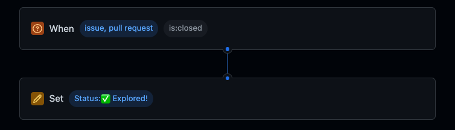

# 🏂🏻 Snowboard Ride Tracker for Winterfest 2022

This is the repository for @davelosert's Demo for the GitHub Winterfest 2022, showing you how you can plan, track and automate your 🏂🏻 Snowboard Rides using [GitHub Projects](https://github.com/features/issues) using [GitHub Actions](https://github.com/features/actions).

This repository contains the actions and issues of the GitHub Project [Snowboard Ride Tracker (Davelosert's Winterfest 2022)](https://github.com/orgs/octodemo/projects/232/views/1)

## How it works

There are 4 Automations built into this repository, working together with the [Snowboard Ride Tracker (Davelosert's Winterfest 2022)](https://github.com/orgs/octodemo/projects/232/views/1) Project.

### 1. Updating the weather and temperature fields in the Project

The logic for this automation is located in the [src/updateWeather.js](./src/updateWeather.js) File. It works like this:

1. It uses the [Project GraphQL API](https://docs.github.com/en/issues/planning-and-tracking-with-projects/automating-your-project/using-the-api-to-manage-projects) to get all fields and items in the project
2. It uses the data of the `lat` and `lon` field of each item to query the [OpenWeatherMap Current Weather Data API](https://openweathermap.org/current) to get the current weather
3. It then uses the [Project GraphQL API](https://docs.github.com/en/issues/planning-and-tracking-with-projects/automating-your-project/using-the-api-to-manage-projects) with a `mutation` query to update the *🌤 Weather* and *🌡 Temperature (in °C)* Fields of the project

The GitHub Action Workflow [update_weather.yml](.github/workflows/update_project_status.yml) checks out the repository, installs NodeJS and the npm packages and then executes the [src/updateWeather.js](./src/updateWeather.js).

## 2. Updating the Ride-Stats (Max Speed, Distance and Burned Calories)

This automation is in the Workflow [get_ride_stats.yml](.github/workflows/get_ride_stats.yml) and it is completely implemented by using [GitHub Actions from the Marketplace](https://github.com/marketplace).

It uses the following actions and works like this:

1. All Issues in this Repository are created with the [trackRide.md Issue Template](.github/ISSUE_TEMPLATE/trackRide.md) (you can read more about [Issue Templates in our official docs](https://docs.github.com/en/communities/using-templates-to-encourage-useful-issues-and-pull-requests/configuring-issue-templates-for-your-repository)) which will palce a json-template for the ride-state into the issue body.
2. Updating the Issue and filling out that template will trigger the Action-Workflow.
3. The JSON-Template is parsed using the action [peter-murray/issue-body-parser-action](https://github.com/marketplace/actions/issue-body-parser), allowing other steps and jobs to access the data in the JSON.
4. The action [monry/actions-get-project-item-id](https://github.com/marketplace/actions/get-project-item-id) will get the item id of the issue that triggered the workflow.
5. The  action [titoportas/update/project/fields](https://github.com/marketplace/actions/update-github-project-fields) then is an easy way to update the fields *🔥 Burned Calories,�*�*Overall Distance (in km)*,*🚀 Maximum Speed*
6. The action [peter-evans/close-issue](https://github.com/marketplace/actions/close-issue) will then close the issue, triggering the [third automation](#3-setting-the-status-to-explored)

## 3. Setting the status to Explored

This automation is no GitHub Action, but a [Project Workflow](https://docs.github.com/en/issues/planning-and-tracking-with-projects/automating-your-project/using-the-built-in-automations) which sets the `Status`-Field to a configured Value whenever an associated Issue or Pull-Request is closed:

You can view this workflow (and others) by:

1. Going to a Project
2. Clicking Button with the three dots on the top right
3. Clicking on `Workflows`
4. On the lefthand side, navigate to `Item Closed`

## 4. Update the Project Status (not showed in Winterfest)

There actually is a fourth automation in the action workflow [update_project_status.yml](.github/workflows/update_project_status.yml) which, on assignment or unassignment of an issue, will set the status either to *🏂 Currently Riding* (if the issue was assigned) or *⌛ Open to explore* (if the issue was unassigned) using the same actions as in [Automation 2](#2-updating-the-ride-stats-max-speed-distance-and-burned-calories), [monry/actions-get-project-item-id](https://github.com/marketplace/actions/get-project-item-id) and [titoportas/update/project/fields](https://github.com/marketplace/actions/update-github-project-fields).

The decision which value to set is done with the action [haya14busa/action-cond](https://github.com/marketplace/actions/conditional-value-for-github-action) depending on the `event_name`.

This showcases how you can also trigger actions directly from the Project-Board.
