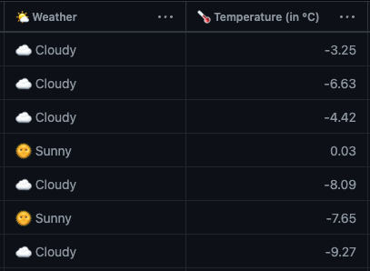
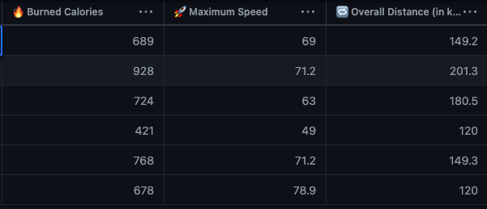
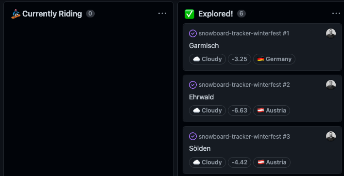
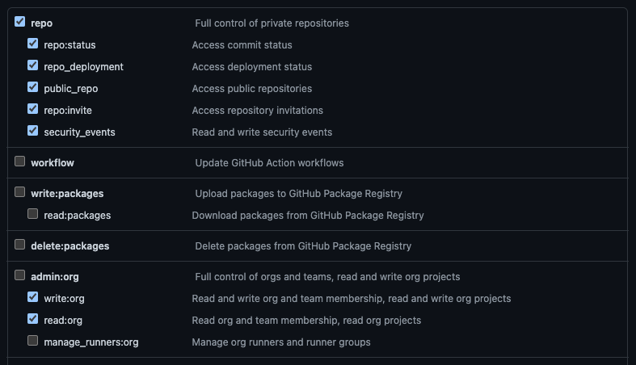
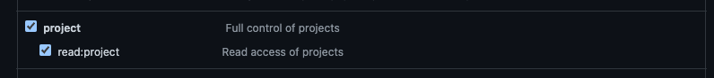
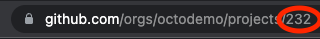

# 🏂🏻 Snowboard Ride Tracker for Winterfest 2022

This is the repository for @davelosert's Demo for the GitHub Winterfest 2022, showing you how you can plan, track and automate your 🏂🏻 Snowboard Rides using [GitHub Projects](https://github.com/features/issues) using [GitHub Actions](https://github.com/features/actions).


This repository contains the actions and issues of the GitHub Project [Snowboard Ride Tracker (Davelosert's Winterfest 2022)](https://github.com/orgs/octodemo/projects/232/views/1)

## Included Automations

There are 4 Automations built into this repository, working together with the [Snowboard Ride Tracker (Davelosert's Winterfest 2022)](https://github.com/orgs/octodemo/projects/232/views/1) Project.

### 1. Updating the weather and temperature fields in the Project



The logic for this automation is located in [src/updateWeather.js](./src/updateWeather.js). It works like this:

1. It uses the [Project GraphQL API](https://docs.github.com/en/issues/planning-and-tracking-with-projects/automating-your-project/using-the-api-to-manage-projects) to get all fields and items in the project
2. It uses the data of the `lat` and `lon` field of each item to query [OpenWeatherMap's *Current Weather Data API*](https://openweathermap.org/current) to get the current weather
3. It then uses the [Project GraphQL API](https://docs.github.com/en/issues/planning-and-tracking-with-projects/automating-your-project/using-the-api-to-manage-projects) with a `mutation` query to update the *🌤 Weather* and *🌡 Temperature (in °C)* fields of the project with the data from step 2.

The GitHub Action Workflow [update_weather.yml](.github/workflows/update_project_status.yml) checks out the repository, installs NodeJS and the npm packages and then executes the [src/updateWeather.js](./src/updateWeather.js).

### 2. Updating the Ride-Stats (Max Speed, Overall Distance and Burned Calories)



This automation is in the GitHub Action Workflow [get_ride_stats.yml](.github/workflows/get_ride_stats.yml) and it is completely implemented by using [GitHub Actions from the Marketplace](https://github.com/marketplace).

It uses the following actions and works like this:

1. All Issues in this Repository are created with the [trackRide.md Issue Template](.github/ISSUE_TEMPLATE/trackRide.md) (you can read more about [Issue Templates in our official docs](https://docs.github.com/en/communities/using-templates-to-encourage-useful-issues-and-pull-requests/configuring-issue-templates-for-your-repository)) which will place a json-template-code-block for the ride-state into the issue body
2. Updating the issue and filling out that template will trigger the Action-Workflow
3. The json template is parsed using the action [peter-murray/issue-body-parser-action](https://github.com/marketplace/actions/issue-body-parser), allowing other steps and jobs to access the data in the JSON.
4. The action [monry/actions-get-project-item-id](https://github.com/marketplace/actions/get-project-item-id) will get the item id of the issue that triggered the workflow
5. The  action [titoportas/update/project/fields](https://github.com/marketplace/actions/update-github-project-fields) then is an easy way to update the fields *🔥 Burned Calories*,*🔁  Overall Distance (in km)*,*🚀 Maximum Speed*
6. The action [peter-evans/close-issue](https://github.com/marketplace/actions/close-issue) will then close the issue, triggering the [third automation](#3-setting-the-status-field-to-explored)

### 3. Setting the status field to Explored

This automation is no GitHub Action, but a [Project Workflow](https://docs.github.com/en/issues/planning-and-tracking-with-projects/automating-your-project/using-the-built-in-automations) which sets the `Status`-Field to a configured Value whenever an associated Issue or Pull-Request is closed:


You can view this workflow (and others) by:

1. Going to a Project.
2. Clicking the Button with the three dots on the top right.
3. Clicking on `Workflows`.
4. On the lefthand side, navigate to `Item Closed`.

### 4. Update the status field through an action (not showed in Winterfest)



There actually is a fourth automation in the action workflow [update_project_status.yml](.github/workflows/update_project_status.yml) which, on assignment or unassignment of an issue, will set the status either to *🏂 Currently Riding* (if the issue was assigned) or *⌛ Open to explore* (if the issue was unassigned) using the same actions as in [Automation 2](#2-updating-the-ride-stats-max-speed-distance-and-burned-calories), [monry/actions-get-project-item-id](https://github.com/marketplace/actions/get-project-item-id) and [titoportas/update/project/fields](https://github.com/marketplace/actions/update-github-project-fields).

The decision which value to set is done with the action [haya14busa/action-cond](https://github.com/marketplace/actions/conditional-value-for-github-action) depending on the `event_name`.

This showcases how you can also trigger actions directly from the Project-Board.

## Set it up on your own

You can also test this yourself doing the following steps:

### 1. Create a GitHub Project

1. [Create a new Project](https://docs.github.com/en/issues/planning-and-tracking-with-projects/creating-projects/creating-a-project)
2. Add the following custom fields to it:
  
| Field Name                  | Type          | Comment                                                                                                                             |
| --------------------------- | ------------- | ----------------------------------------------------------------------------------------------------------------------------------- |
| Status                      | Single Select | This field is already defined, you just have to adjust the values to:<br/>⌛ Open to explore<br/>🏂 Currently Riding<br/>✅  Explored! |
| 🔥 Burned Calories           | Number        |                                                                                                                                     |
| 🚀  Maximum Speed            | Number        |                                                                                                                                     |
| 🗺  Country                  | Single select | Put in the following values (or any other country of your choosing):<br/>🇦‍🇹 Austria<br/>🇨‍🇭 Switzerland<br/>🇫‍🇷 France<br/>🇩‍🇪 Germany |
| 🔁  Overall Distance (in km) | Number        |                                                                                                                                     |
| 🌐 Lat                       | Text          |                                                                                                                                     |
| 🌐 Lon                       | Text          |                                                                                                                                     |
| 🌡 Temperature (in °C)       | Number        |                                                                                                                                     |
| 🌤 Weather                   | Text          |                                                                                                                                     |

### 2. Prepare the Repo

1. Fork this repository into your own personal space or your organization
2. Create a [GitHub PAT (classical)](https://docs.github.com/en/authentication/keeping-your-account-and-data-secure/creating-a-personal-access-token) with the follwoing scopes and store it away safely:
      1. `repo`
      2. `write:org` and `read:org` (only required if you are using a project in an organization)
      
      4. `project` and `read:project`
      
3. Get the Project Id from your created Project through GraphQL. The Project Number is the digit in the Url of the project after `/projects/<project_number>`, e.g. in this url it would be `232`:

   

    You can use the [GitHub CLI](https://docs.github.com/en/github-cli/github-cli/about-github-cli) like this (fill in the data):

      ```shell
        gh api graphql -f query='
          query($organization: String! $number: Int!){
            organization(login: $organization){
              projectV2(number: $number) {
                id
              }
            }
          }' -f organization="<YOUR_ORG_OR_USERNAME>" -F number=<THE_PROEJCT_NUMBER>
      ```

4. Create a free Account on <https://openweathermap.org/> and create an API Key
5. Create the following Action-Secrets in the forked repository:
    1. `PROJECT_URL` with the URL of your Project
    2. `PROJECT_TOKEN` with the Token from Step 3
    3. `PROJECT_ID` with the Project Id from step 4
    4. `WEATHER_API_KEY` with the API key from Step

### 3. Add Riding Place Issues

Now you only need to add some places by:

1. Create an Issue in the forked Repostiory
2. [Link the Issues to the project board](https://docs.github.com/en/issues/planning-and-tracking-with-projects/managing-items-in-your-project/adding-items-to-your-project)
3. Fill in the 🌐 Lat and 🌐 Lon Values (I used google maps, you can right click and copy the values for any place)

After this, you are all set to trigger the automations as described in the Demo. Have a great Ride!
